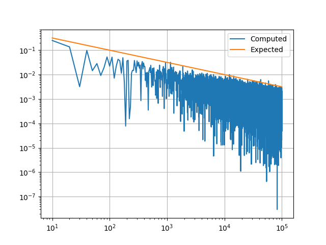
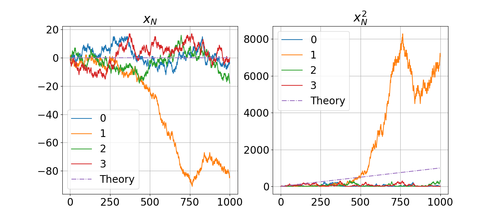
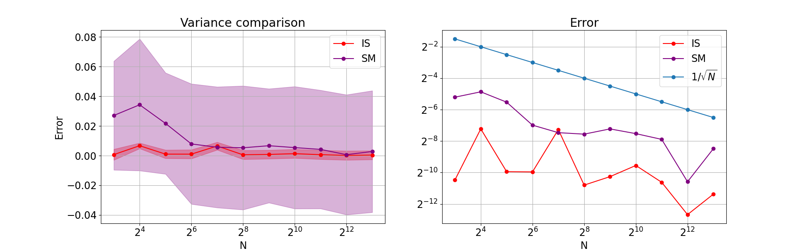
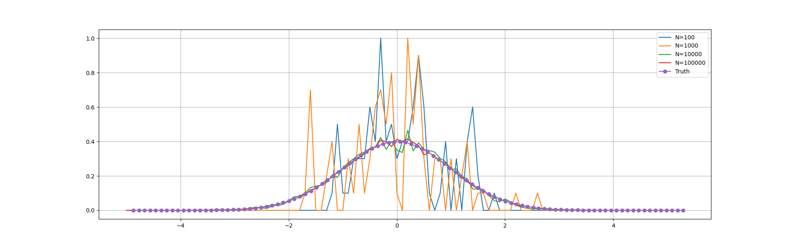
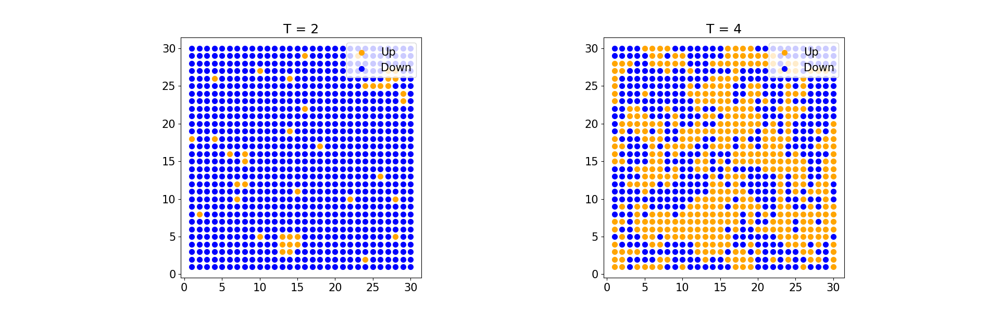

# Computational Physics Lab
Weekly exercises for the course _Computational Physics Lab_ @ UniTS.

## Week 1
Course presentation, basics.

## Week 2
Pseudo-random number generators I.

## Week 3
Pseudo-random number generators II.

## Week 4
Stochastic processes: radioactive decay and random walks.

## Week 5
Numerical integration and Monte Carlo methods.

## Week 6
Metropolis Monte Carlo method.

## Week 7
Ising model.
